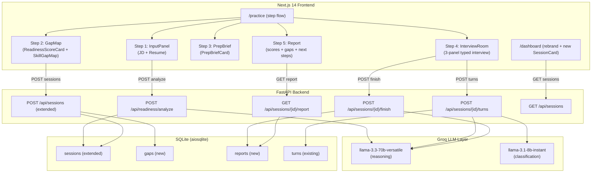
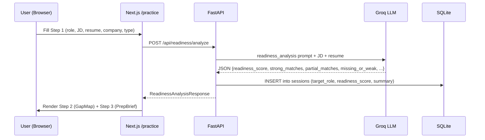
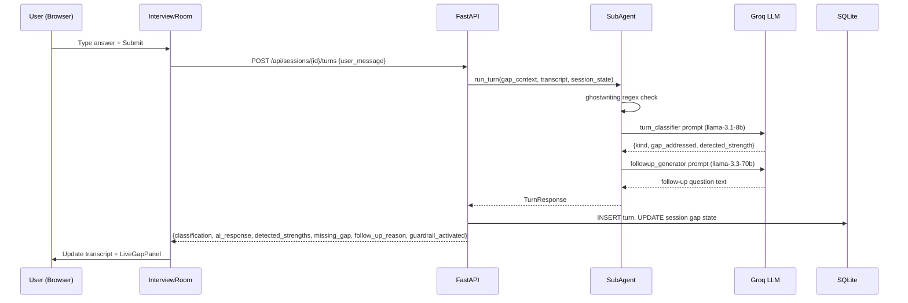
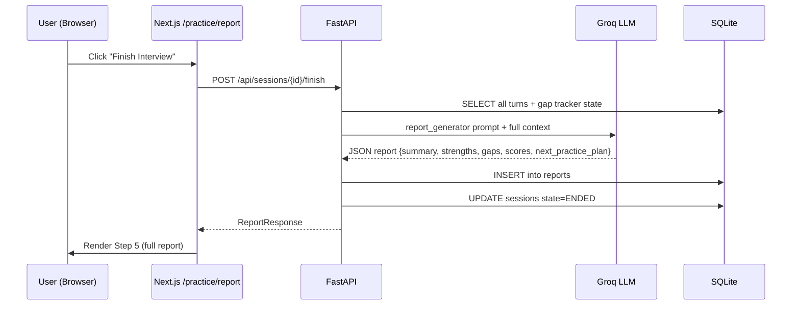

# Design Document: RoleReady AI MVP

> **Implementation Status:** This document describes the planned RoleReady AI MVP architecture. The current implementation has a **dual-backend architecture** with the AI Core (:8001) fully operational for voice-first interviews, while the gap analysis engine and adaptive interview features described here are **planned but not yet implemented**. See `.kiro/steering/architecture.md` for current implementation status.

## Overview

RoleReady AI extends the existing `interview-coach` FastAPI + Next.js application into a job-description-aware mock interview platform. The system ingests a candidate's resume and a target job description, produces a readiness gap map, runs an adaptive typed interview that probes identified gaps, and generates a learning-focused multi-dimensional feedback report — all without ghostwriting answers for the candidate.

The existing voice-based interview loop (WebSocket + ASR/TTS) is preserved and reused as a secondary mode. The new primary interaction mode is typed text. All new backend code is additive: new routes, new DB tables, new prompt files, and extensions to existing orchestrator state — nothing is deleted or replaced.

---

## Architecture



---

## Sequence Diagrams

### Workstream 1: Gap Analysis Flow



### Workstream 2: Adaptive Interview Turn Flow



### Workstream 3: Report Generation Flow



---

## Components and Interfaces

### Backend: Workstream 1 — Gap Engine

#### `POST /api/readiness/analyze`

**Request:**
```typescript
interface ReadinessAnalyzeRequest {
  target_role: string          // e.g. "Backend Engineer Intern"
  job_description: string      // full JD text
  resume: string               // full resume text
  company_name?: string        // optional
  interview_type: string       // "technical" | "behavioral" | "mixed"
}
```

**Response:**
```typescript
interface ReadinessAnalysisResponse {
  session_id: string           // created session for this analysis
  readiness_score: number      // 0–100
  summary: string              // 2–3 sentence narrative
  strong_matches: SkillItem[]
  partial_matches: SkillItem[]
  missing_or_weak: SkillItem[]
  interview_focus_areas: string[]   // ordered list, most important first
  prep_brief: string[]              // bullet points for quick prep
}

interface SkillItem {
  label: string
  evidence: string | null      // quote from resume or null
  category: "strong" | "partial" | "missing"
}
```

**Mock mode** (MOCK_LLM=1 or no GROQ_API_KEY): Returns deterministic demo data for the "Backend Engineer Intern" scenario.

#### Prompt: `prompts/readiness_analysis.md`

System prompt instructs the LLM to:
- Compare JD requirements against resume evidence
- Assign a 0–100 readiness score
- Categorize each skill as strong/partial/missing with evidence quotes
- Identify top 3–5 interview focus areas
- Generate a prep brief (5–7 bullet points)
- Return strict JSON matching `ReadinessAnalysisResponse` shape

#### DB: Extended `sessions` table

```sql
ALTER TABLE sessions ADD COLUMN target_role TEXT;
ALTER TABLE sessions ADD COLUMN company_name TEXT;
ALTER TABLE sessions ADD COLUMN interview_type TEXT DEFAULT 'mixed';
ALTER TABLE sessions ADD COLUMN readiness_score INTEGER;
ALTER TABLE sessions ADD COLUMN summary TEXT;
```

#### DB: New `gaps` table

```sql
CREATE TABLE IF NOT EXISTS gaps (
    id          TEXT PRIMARY KEY,
    session_id  TEXT NOT NULL REFERENCES sessions(id) ON DELETE CASCADE,
    label       TEXT NOT NULL,
    category    TEXT NOT NULL CHECK (category IN ('strong', 'partial', 'missing')),
    evidence    TEXT,
    status      TEXT NOT NULL DEFAULT 'open'
                     CHECK (status IN ('open', 'improved', 'closed')),
    created_at  TEXT NOT NULL DEFAULT (datetime('now'))
);
CREATE INDEX IF NOT EXISTS gaps_session ON gaps (session_id);
```

---

### Backend: Workstream 2 — Adaptive Interview Loop

#### `POST /api/sessions` (extended)

Extended to accept readiness analysis output and generate gap-driven questions:

**Request (extended):**
```typescript
interface CreateSessionRequest {
  mode: string                        // "learning" | "professional"
  persona_id: string                  // "friendly" | "neutral" | "challenging"
  // New fields:
  readiness_analysis?: {
    session_id: string                // from /api/readiness/analyze
    strong_matches: SkillItem[]
    partial_matches: SkillItem[]
    missing_or_weak: SkillItem[]
    interview_focus_areas: string[]
    target_role: string
    interview_type: string
  }
}
```

When `readiness_analysis` is provided, the session manager generates interview questions from the gap data instead of loading `demo_questions.yaml`.

#### `POST /api/sessions/{session_id}/turns`

New typed-mode endpoint replacing the WebSocket for text input:

**Request:**
```typescript
interface TurnRequest {
  user_message: string
}
```

**Response:**
```typescript
interface TurnResponse {
  turn_id: string
  classification: string              // "complete" | "partial" | "clarify" | "stall" | "refusal"
  ai_response: string                 // the interviewer's next utterance
  detected_strengths: string[]        // skills demonstrated in this turn
  missing_gap: string | null          // gap being probed in follow-up
  follow_up_reason: string | null     // why the AI asked this follow-up
  guardrail_activated: boolean        // true if ghostwriting was detected
  updated_session_state: {
    current_gap_being_tested: string | null
    probe_count: number
    open_gaps: string[]
    closed_gaps: string[]
    guardrail_activations: number
    session_status: string            // "active" | "closing" | "ended"
  }
}
```

#### Extended `SessionState` (orchestrator/state.py)

```python
@dataclass
class SessionState:
    # ... existing fields ...
    # New fields for RoleReady:
    target_role: str | None = None
    interview_type: str | None = None
    gap_context: list[dict] = field(default_factory=list)   # from readiness analysis
    current_gap_being_tested: str | None = None
    open_gaps: list[str] = field(default_factory=list)
    closed_gaps: list[str] = field(default_factory=list)
    guardrail_activations: int = 0
    interview_focus_areas: list[str] = field(default_factory=list)
```

#### New Prompt Files

- `prompts/turn_classifier.md` — extends `classify_turn.md` with gap-awareness: classifies turn AND extracts detected strengths and the specific gap being addressed
- `prompts/followup_generator.md` — extends `generate_probe.md` with explicit `follow_up_reason` output field
- `prompts/guardrail.md` — replaces `scaffold_refusal.md` with mode-aware refusal + reason field

#### Frontend: InterviewRoom Three-Panel Layout

```
┌─────────────────────────────────────────────────────────────────┐
│  Left Panel (240px)    │  Center Panel (flex)  │  Right Panel   │
│                        │                       │  (280px)       │
│  Question #2 of 5      │  [Agent bubble]       │  LiveGapPanel  │
│  Focus: SQL Design     │  "Tell me about..."   │                │
│  Gap: DB scaling       │                       │  ✓ Strength:   │
│  Probes: 1/3           │  [Candidate bubble]   │  Flask API     │
│  Status: Active        │  "I used SQLite..."   │                │
│                        │                       │  ⚠ Missing:    │
│                        │  [Agent bubble]       │  DB scaling    │
│                        │  "How would you..."   │                │
│                        │                       │  Why follow-up:│
│                        │  ┌──────────────────┐ │  "Candidate    │
│                        │  │ Type your answer │ │  didn't cover  │
│                        │  │                  │ │  horizontal    │
│                        │  └──────────────────┘ │  scaling"      │
│                        │  [Submit] [🎤 Voice]  │                │
└─────────────────────────────────────────────────────────────────┘
```

---

### Backend: Workstream 3 — Feedback Report

#### `POST /api/sessions/{session_id}/finish`

Generates the full report from session turns + gap tracker state.

**Response:**
```typescript
interface FinishSessionResponse {
  report_id: string
  session_id: string
  summary: string
  strengths: string[]
  gaps: GapReportItem[]
  scores: {
    role_alignment: number          // 0–10
    technical_clarity: number       // 0–10
    communication: number           // 0–10
    evidence_strength: number       // 0–10
    followup_recovery: number       // 0–10
  }
  follow_up_analysis: FollowUpAnalysisItem[]
  next_practice_plan: string[]
}

interface GapReportItem {
  label: string
  status: "open" | "improved" | "closed"
  evidence: string | null
}

interface FollowUpAnalysisItem {
  question: string
  reason: string
  candidate_response_quality: string   // "strong" | "partial" | "weak"
}
```

#### `GET /api/sessions/{session_id}/report`

Returns the stored report (same shape as `FinishSessionResponse` plus metadata).

#### DB: New `reports` table

```sql
CREATE TABLE IF NOT EXISTS reports (
    id              TEXT PRIMARY KEY,
    session_id      TEXT NOT NULL REFERENCES sessions(id) ON DELETE CASCADE,
    summary         TEXT NOT NULL,
    strengths_json  TEXT NOT NULL,   -- JSON array
    gaps_json       TEXT NOT NULL,   -- JSON array
    scores_json     TEXT NOT NULL,   -- JSON object
    followup_json   TEXT NOT NULL,   -- JSON array
    next_steps_json TEXT NOT NULL,   -- JSON array
    created_at      TEXT NOT NULL DEFAULT (datetime('now'))
);
```

#### Prompt: `prompts/report_generator.md`

System prompt instructs the LLM to:
- Analyze full turn history + gap tracker state
- Score 5 dimensions (0–10 each) with brief justification
- List concrete strengths with transcript evidence
- List gaps with open/improved/closed status
- Explain each follow-up probe (why it was asked, how candidate responded)
- Generate a 3–5 item next practice plan
- Return strict JSON matching `FinishSessionResponse` shape

---

## Data Models

### Extended `sessions` table (migration)

```sql
-- Migration: 002_roleready_extensions.sql
ALTER TABLE sessions ADD COLUMN target_role TEXT;
ALTER TABLE sessions ADD COLUMN company_name TEXT;
ALTER TABLE sessions ADD COLUMN interview_type TEXT DEFAULT 'mixed';
ALTER TABLE sessions ADD COLUMN readiness_score INTEGER;
ALTER TABLE sessions ADD COLUMN summary TEXT;
```

### `gaps` table (new)

| Column     | Type | Notes |
|------------|------|-------|
| id         | TEXT | UUID PK |
| session_id | TEXT | FK → sessions |
| label      | TEXT | Skill name, e.g. "Database scaling" |
| category   | TEXT | strong / partial / missing |
| evidence   | TEXT | Resume quote or null |
| status     | TEXT | open / improved / closed |
| created_at | TEXT | ISO timestamp |

### `reports` table (new)

| Column         | Type | Notes |
|----------------|------|-------|
| id             | TEXT | UUID PK |
| session_id     | TEXT | FK → sessions |
| summary        | TEXT | Narrative summary |
| strengths_json | TEXT | JSON array of strings |
| gaps_json      | TEXT | JSON array of GapReportItem |
| scores_json    | TEXT | JSON object with 5 scores |
| followup_json  | TEXT | JSON array of FollowUpAnalysisItem |
| next_steps_json| TEXT | JSON array of strings |
| created_at     | TEXT | ISO timestamp |

---

## Frontend Route Structure

```
/practice                    → redirects to /practice/setup
/practice/setup              → Step 1: InputPanel (JD + resume)
/practice/gap-map            → Step 2: GapMap (after analysis)
/practice/prep-brief         → Step 3: PrepBrief
/practice/interview          → Step 4: InterviewRoom (typed)
/practice/report             → Step 5: Report
/dashboard                   → Rebranded dashboard with RoleReady SessionCards
```

State flows through URL query params (`?session_id=...`) and sessionStorage for the multi-step flow.

### New Frontend Components

#### `web/components/roleready/InputPanel.tsx`
- Target role text input
- JD textarea (min 3 rows, expandable)
- Resume textarea (min 5 rows, expandable)
- Company name input (optional)
- Interview type selector (technical / behavioral / mixed)
- "Analyze My Readiness" submit button with loading state

#### `web/components/roleready/StepProgress.tsx`
- 5-step progress indicator
- Current step highlighted
- Completed steps checkmarked
- Step labels: Setup → Gap Map → Prep Brief → Interview → Report

#### `web/components/roleready/ReadinessScoreCard.tsx`
- Large circular score display (0–100)
- Color coding: 0–40 red, 41–70 amber, 71–100 green
- Summary text below score
- Skill count badges (X strong, Y partial, Z missing)

#### `web/components/roleready/SkillGapMap.tsx`
- Three columns: Strong (green), Partial (amber), Missing (red)
- Each skill as a badge with evidence tooltip on hover
- Interview focus areas listed below the map

#### `web/components/roleready/PrepBriefCard.tsx`
- Bulleted prep checklist
- Each item is a concrete action ("Practice explaining database indexing with a real example")
- "Start Interview" CTA button

#### `web/components/roleready/InterviewRoom.tsx`
- Three-panel layout (left sidebar, center chat, right gap panel)
- Manages typed input state and submission
- Calls `POST /api/sessions/{id}/turns`
- Handles guardrail badge display

#### `web/components/roleready/TranscriptBubble.tsx`
- Agent bubble: indigo background, left-aligned avatar
- Candidate bubble: gray background, right-aligned
- Guardrail badge inline when `guardrail_activated: true`
- Timestamp on hover

#### `web/components/roleready/LiveGapPanel.tsx`
- Detected strength (green chip)
- Missing gap being probed (amber chip)
- Follow-up reason (italic text)
- Running gap tracker: open gaps list, closed gaps list
- Probe count indicator

#### `web/components/roleready/GhostwritingGuardrailBadge.tsx`
- Small inline badge: "🛡 Ghostwriting guardrail activated"
- Amber/orange color
- Tooltip explaining the policy

#### `web/components/roleready/ReportSummary.tsx`
- Session metadata header (role, date, duration)
- Narrative summary paragraph
- Readiness score delta (before vs after interview)

#### `web/components/roleready/ScoreCard.tsx`
- Dimension name + score (0–10)
- Horizontal progress bar
- One-line justification text
- Color: 0–4 red, 5–7 amber, 8–10 green

#### `web/components/roleready/NextPracticePlan.tsx`
- Ordered list of practice items
- Each item has an icon (📚 read, 💻 code, 🗣 practice)
- "Start Another Session" CTA

#### `web/components/roleready/DashboardStats.tsx`
- Summary stats bar: total sessions, avg readiness score, most common gap
- Shown at top of dashboard when sessions exist

---

## Error Handling

### Gap Analysis Errors

| Scenario | Response | Recovery |
|----------|----------|----------|
| LLM returns malformed JSON | 500 with `detail: "Analysis failed"` | Frontend shows retry button |
| JD or resume too short (<50 chars) | 422 with field validation error | Frontend shows inline error |
| GROQ_API_KEY missing + MOCK_LLM not set | 503 with `detail: "LLM unavailable"` | Frontend shows config error |
| MOCK_LLM=1 | 200 with deterministic demo data | No error — demo mode |

### Interview Turn Errors

| Scenario | Response | Recovery |
|----------|----------|----------|
| Session not found | 404 | Frontend redirects to /practice |
| Session already ended | 409 | Frontend shows "Session complete" message |
| LLM timeout | 504 | Frontend shows "AI is thinking..." retry |
| Ghostwriting detected | 200 with `guardrail_activated: true` | Frontend shows guardrail badge, no retry needed |

### Report Generation Errors

| Scenario | Response | Recovery |
|----------|----------|----------|
| No turns in session | 422 | Frontend shows "Complete at least one question" |
| Report already exists | 200 (idempotent, returns existing) | No error |
| LLM returns partial JSON | Partial report with null fields | Frontend renders available sections |

---

## Testing Strategy

### Unit Testing Approach

- `backend/tests/test_readiness.py` — test `analyze_readiness()` with mock LLM responses
- `backend/tests/test_turn_classifier.py` — test classification logic with fixture transcripts
- `backend/tests/test_guardrail.py` — test ghostwriting regex patterns
- `backend/tests/test_gap_tracker.py` — test gap open/close/probe logic (extends existing `test_orchestrator.py`)
- `backend/tests/test_report.py` — test report generation with fixture session data

### Property-Based Testing Approach

**Property Test Library**: `hypothesis` (Python)

Key properties to verify:
- `readiness_score` is always in [0, 100]
- Every skill in JD appears in exactly one of: strong_matches, partial_matches, missing_or_weak
- `guardrail_activated` is always `true` when transcript matches ghostwriting patterns
- `probe_count` never exceeds 3 per gap
- Report scores are always in [0, 10]

### Integration Testing Approach

- End-to-end flow test: analyze → create session → 3 turns → finish → get report
- Mock LLM mode: full flow with MOCK_LLM=1, no API key required
- DB migration test: verify schema changes don't break existing session/turn queries

---

## Performance Considerations

- Gap analysis LLM call: ~2–4s on llama-3.3-70b. Acceptable for a one-time setup step.
- Turn classification: llama-3.1-8b-instant, target <500ms per turn.
- Report generation: llama-3.3-70b, ~3–6s. Triggered once at session end.
- SQLite is sufficient for hackathon scale (single user, demo mode).
- No streaming needed for typed mode — full response per turn is fine.

---

## Security Considerations

- No authentication beyond the existing `demo-user-001` hardcoded user (hackathon scope).
- Resume and JD text are stored in SQLite only; not sent to any third party beyond Groq.
- Ghostwriting guardrail is enforced server-side (regex + LLM classification), not just client-side.
- GROQ_API_KEY is read from environment, never logged or returned in API responses.
- Input length limits: JD max 8000 chars, resume max 6000 chars (enforced in Pydantic models).

---

## Mock / Demo Mode

When `MOCK_LLM=1` environment variable is set (or `GROQ_API_KEY` is absent), all LLM calls return deterministic fixture data based on the demo scenario:

**Demo scenario:**
- Target role: Backend Engineer Intern
- Strong: Python, REST APIs, Git, Team project
- Partial: SQL, Authentication, Cloud basics
- Missing: Database scaling, Production debugging, Metrics/measurable impact, System design trade-offs
- Readiness score: 58
- Interview focus areas: Database design, System scalability, Measurable impact

Mock responses are defined in `backend/llm/mock_responses.py` (new file) and selected by key (e.g., `"readiness_analysis"`, `"turn_classifier"`, `"report_generator"`).

---

## Dependencies

**Backend (additions to `requirements.txt`):**
- No new packages required — `groq`, `fastapi`, `aiosqlite`, `pydantic` already present
- `hypothesis` for property-based tests (dev dependency)

**Frontend (no new packages):**
- Next.js 14, TypeScript, Tailwind already present
- No new npm packages needed — all UI built with existing stack

**Infrastructure:**
- New migration file: `database/migrations/002_roleready_extensions.sql`
- New seed file: `database/seed_data/demo_session.yaml` (demo gap data for dashboard)
- Docker Compose unchanged (2 containers: backend + frontend)
