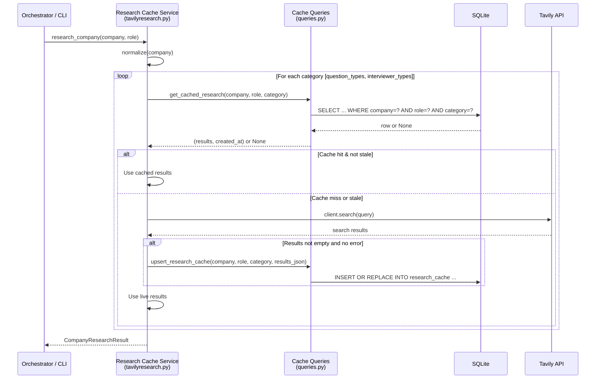

# Design Document: Tavily Research Cache

## Overview

This feature adds a transparent caching layer between the existing `research_company()` function and the Tavily API. When a company + role + search category combination has been fetched before and the cached entry is not stale, the system returns the cached results from SQLite instead of making a live API call. When no cache entry exists or the entry has expired past its TTL, the system fetches fresh results from Tavily, stores them in the cache, and returns them.

The design preserves full backward compatibility — callers of `research_company()`, `search_company_question_types()`, and `search_company_interviewer_types()` see no signature or return-type changes. Cache operations are best-effort: if the cache table is missing or a DB error occurs, the system falls back to live Tavily calls and logs a warning.

### Key Design Decisions

1. **Single new table, same DB** — The cache lives in the existing SQLite database alongside `sessions` and `turns`. No new database files or connections.
2. **Upsert via `INSERT OR REPLACE`** — SQLite's `INSERT OR REPLACE` on the unique constraint handles both insert and refresh in one statement, keeping the query layer simple.
3. **Async conversion of research functions** — The existing `search_company_*` and `research_company` functions are synchronous. They will be converted to `async` to use `aiosqlite` for cache operations. This is safe because the only caller is the orchestrator, which already runs in an async context.
4. **Normalization at the service layer** — Company names are lowercased and stripped before cache key lookup, so `"Google"`, `"google"`, and `" Google "` all resolve to the same entry.
5. **TTL via timestamp comparison** — Staleness is computed at query time by comparing `created_at` against `datetime('now')` minus the configured TTL. No background cleanup jobs.

## Architecture



The cache layer sits entirely within `tavilyresearch.py`. It calls new query functions added to `queries.py` (or a dedicated `cache_queries.py` — see Components below). The existing `init_db()` in `db/init.py` is extended to create the cache table on startup.

## Components and Interfaces

### 1. Cache Table (schema.sql addition)

A new `CREATE TABLE IF NOT EXISTS research_cache` block appended to `schema.sql`, executed by `init_db()` on startup.

### 2. Cache Query Functions (backend/db/cache_queries.py)

A new module following the same patterns as `queries.py`:

```python
# backend/db/cache_queries.py

async def get_cached_research(
    company: str, role: str, category: str, ttl_hours: int
) -> list[dict] | None:
    """
    Return deserialized results list if a non-stale entry exists, else None.
    Staleness is checked in SQL: created_at > datetime('now', '-{ttl_hours} hours').
    """
    ...

async def upsert_research_cache(
    company: str, role: str, category: str, results_json: str
) -> None:
    """
    Insert or replace a cache entry. Uses INSERT OR REPLACE
    on the (company, role, search_category) unique constraint.
    """
    ...
```

Both functions use `async with await get_db() as db` and parameterized queries, matching the existing pattern in `queries.py`.

### 3. Research Cache Service (modifications to backend/llm/tavilyresearch.py)

The existing module gains:

- A `_normalize_company(name: str) -> str` helper that returns `name.strip().lower()`.
- A `_get_ttl_hours() -> int` helper that reads `TAVILY_CACHE_TTL_HOURS` from env, defaulting to `168` (7 days).
- Async versions of `search_company_question_types`, `search_company_interviewer_types`, and `research_company` that check the cache before calling Tavily.
- A `try/except` around all cache operations so that DB failures fall back to live Tavily calls with a logged warning.

### 4. Schema Initialization (backend/db/init.py)

No code changes needed — `init_db()` already runs the full `schema.sql` via `executescript`. Adding the new `CREATE TABLE IF NOT EXISTS` to `schema.sql` is sufficient.

## Data Models

### research_cache Table

| Column | Type | Constraints | Description |
|--------|------|-------------|-------------|
| `id` | TEXT | PRIMARY KEY | UUID, auto-generated |
| `company` | TEXT | NOT NULL | Normalized (lowercase, trimmed) company name |
| `role` | TEXT | NOT NULL | Role string, e.g. `"software engineer"` |
| `search_category` | TEXT | NOT NULL, CHECK IN ('question_types', 'interviewer_types') | Which search type this entry caches |
| `results_json` | TEXT | NOT NULL | JSON-serialized list of result dicts |
| `created_at` | TEXT | NOT NULL, DEFAULT datetime('now') | Timestamp for TTL computation |

**Unique constraint:** `(company, role, search_category)` — ensures one entry per cache key.

**Index:** The unique constraint implicitly creates an index on the lookup columns.

### SQL DDL

```sql
CREATE TABLE IF NOT EXISTS research_cache (
    id               TEXT PRIMARY KEY,
    company          TEXT NOT NULL,
    role             TEXT NOT NULL,
    search_category  TEXT NOT NULL CHECK (search_category IN ('question_types', 'interviewer_types')),
    results_json     TEXT NOT NULL,
    created_at       TEXT NOT NULL DEFAULT (datetime('now')),
    UNIQUE (company, role, search_category)
);
```

### CompanyResearchResult (unchanged)

The existing dataclass remains the public return type:

```python
@dataclass
class CompanyResearchResult:
    company: str
    role: str
    question_types: list[dict] = field(default_factory=list)
    interviewer_types: list[dict] = field(default_factory=list)
```

## Correctness Properties

*A property is a characteristic or behavior that should hold true across all valid executions of a system — essentially, a formal statement about what the system should do. Properties serve as the bridge between human-readable specifications and machine-verifiable correctness guarantees.*

### Property 1: Cache round-trip preserves data

*For any* valid list of result dicts (each containing title, url, content, score), upserting that list into the cache for a given (company, role, category) key and then looking it up by the same key should return a list equal to the original.

**Validates: Requirements 5.1, 5.2**

### Property 2: Upsert idempotence — one row per cache key

*For any* (company, role, category) cache key and any two distinct results payloads, upserting the first payload and then upserting the second payload for the same key should result in exactly one row in the database for that key, and looking it up should return the second (latest) payload.

**Validates: Requirements 1.2, 3.2**

### Property 3: Company name normalization

*For any* string `s`, the normalized form of `s` should equal the normalized form of `s.upper()`, `s.lower()`, `"  " + s + "  "`, and `"\t" + s + "\n"`. Furthermore, for any (company, role, category) cache entry, looking it up with any case/whitespace variation of the company name should return the same cached data.

**Validates: Requirements 2.4**

### Property 4: Non-stale cache hit avoids API call

*For any* valid (company, role) pair and any non-empty results list, if a cache entry exists with a creation timestamp within the TTL window, calling the research function should return the cached results and should not invoke the Tavily client.

**Validates: Requirements 2.1, 2.2, 3.1**

### Property 5: Staleness boundary correctness

*For any* TTL value (in hours) and any cache entry, the entry should be treated as stale if and only if its creation timestamp is older than `now - ttl_hours`. Entries exactly at the boundary or newer should be treated as fresh.

**Validates: Requirements 4.1**

### Property 6: Stale entry triggers refresh and cache update

*For any* (company, role, category) cache key with a stale entry and any new non-empty results from Tavily, calling the research function should invoke the Tavily client, update the cache entry with the new results and a fresh timestamp, and return the new results.

**Validates: Requirements 3.2, 4.3**

### Property 7: Tavily error preserves existing cache entry

*For any* (company, role, category) cache key with an existing entry (stale or fresh), if the Tavily client raises an error or returns an empty result set, the existing cache entry should remain unchanged (same results_json and created_at).

**Validates: Requirements 3.3**

## Error Handling

### Cache Operation Failures

All cache reads and writes in `tavilyresearch.py` are wrapped in `try/except Exception` blocks. On any database error:

1. **Log a warning** with the exception details via `logging.getLogger(__name__).warning(...)`.
2. **Fall back to live Tavily call** — the function proceeds as if no cache exists.
3. **Do not propagate the exception** — callers never see cache-related errors.

This ensures the caching layer is purely additive and cannot break existing functionality.

```python
async def search_company_question_types(company: str, role: str = "software engineer") -> list[dict]:
    normalized = _normalize_company(company)
    ttl = _get_ttl_hours()

    # Best-effort cache read
    try:
        cached = await get_cached_research(normalized, role, "question_types", ttl)
        if cached is not None:
            return cached
    except Exception:
        logger.warning("Cache read failed for %s/%s/question_types, falling back to Tavily", company, role, exc_info=True)

    # Live fetch
    results = _fetch_from_tavily(company, role, "question_types")

    # Best-effort cache write
    if results:
        try:
            await upsert_research_cache(normalized, role, "question_types", json.dumps(results))
        except Exception:
            logger.warning("Cache write failed for %s/%s/question_types", company, role, exc_info=True)

    return results
```

### Tavily API Failures

When the Tavily client raises an exception or returns an empty result set during a cache-miss or stale-refresh flow:

1. **Preserve any existing cache entry** — do not delete or overwrite stale data with nothing.
2. **Return the stale cached data if available** — better to return slightly outdated results than nothing.
3. **If no cached data exists at all**, propagate the error to the caller (existing behavior, unchanged).

### Invalid TTL Configuration

If `TAVILY_CACHE_TTL_HOURS` is set to a non-integer or negative value:

1. **Fall back to the default TTL of 168 hours (7 days)**.
2. **Log a warning** about the invalid configuration value.

```python
def _get_ttl_hours() -> int:
    raw = os.getenv("TAVILY_CACHE_TTL_HOURS")
    if raw is None:
        return 168  # 7 days
    try:
        val = int(raw)
        if val <= 0:
            raise ValueError("TTL must be positive")
        return val
    except (ValueError, TypeError):
        logger.warning("Invalid TAVILY_CACHE_TTL_HOURS=%r, using default 168h", raw)
        return 168
```

## Testing Strategy

### Property-Based Tests

Property-based testing is well-suited for this feature because the core logic involves:
- **Pure data transformations** (normalization, serialization round-trips)
- **Universal invariants** (uniqueness constraints, staleness boundaries)
- **Input spaces that benefit from randomization** (arbitrary company names, result payloads, timestamps)

**Library:** [Hypothesis](https://hypothesis.readthedocs.io/) — the standard PBT library for Python. It will need to be added to `backend/requirements.txt`.

**Configuration:** Each property test runs a minimum of 100 examples (`@settings(max_examples=100)`).

**Tagging:** Each test is tagged with a comment referencing the design property:
```python
# Feature: tavily-research-cache, Property 1: Cache round-trip preserves data
```

**Property tests to implement:**

| Property | What it tests | Key generators |
|----------|--------------|----------------|
| 1: Cache round-trip | upsert → lookup returns same data | Random lists of result dicts (title, url, content, score) |
| 2: Upsert idempotence | two upserts → one row, latest data | Random (company, role, category) keys + two distinct payloads |
| 3: Normalization | case/whitespace invariance | Random strings with injected case changes and whitespace |
| 4: Cache hit avoids API | non-stale entry → no Tavily call | Random results + recent timestamps |
| 5: Staleness boundary | TTL boundary correctness | Random TTL values + timestamps near the boundary |
| 6: Stale refresh | stale entry → Tavily called, cache updated | Random stale entries + random fresh results |
| 7: Error preservation | Tavily error → cache unchanged | Random existing entries + simulated errors |

### Unit Tests (Example-Based)

Unit tests cover specific scenarios, edge cases, and integration points that don't benefit from randomization:

- **Default TTL value**: `_get_ttl_hours()` returns 168 when env var is unset.
- **Custom TTL value**: `_get_ttl_hours()` reads `TAVILY_CACHE_TTL_HOURS` correctly.
- **Invalid TTL fallback**: Non-integer or negative env var falls back to 168.
- **Cache miss → Tavily call**: Empty cache triggers live API call (mock Tavily client).
- **Function signature preservation**: `research_company`, `search_company_question_types`, `search_company_interviewer_types` accept the same args and return the same types.
- **Graceful fallback on DB error**: When `get_db()` raises, research functions still return Tavily results and log a warning.
- **Table creation on startup**: `init_db()` creates the `research_cache` table.

### Test Infrastructure

- **Database**: Each test uses an in-memory SQLite database (`:memory:`) via a fixture that patches `get_db()`.
- **Tavily client**: Mocked via `unittest.mock.AsyncMock` or `pytest-mock` to avoid real API calls.
- **Environment variables**: Managed via `monkeypatch` fixture for TTL configuration tests.
- **Test location**: `backend/tests/test_cache.py` for all cache-related tests.

### Test Dependencies

Add to `backend/requirements.txt`:
```
hypothesis==6.100.0
```

