# RoleReady AI — Architecture & Tech Stack

## Architecture Overview

RoleReady AI is a **single-process FastAPI backend + Next.js frontend** architecture optimized for hackathon MVP delivery. Three independent microservices run as modules within the FastAPI process, communicating via direct function calls rather than HTTP.

```mermaid
graph TB
    subgraph Browser ["Browser (Next.js 14)"]
        LP[Landing/Setup Page]
        GM[Gap Map Page]
        PB[Prep Brief Page]
        IR[Interview Room Page]
        RP[Report Page]
        DB[Dashboard Page]
    end

    subgraph FastAPI ["FastAPI Backend (Single Process)"]
        subgraph Ishaq ["Ishaq's Module: Gap Engine"]
            RA[POST /api/readiness/analyze]
            GAP[Gap Analysis Logic]
            MOCK1[Mock Response Handler]
        end
        
        subgraph Shivam ["Shivam's Module: Interview Orchestrator"]
            SESS[POST /api/sessions]
            TURN[POST /api/sessions/:id/turns]
            ORCH[Orchestrator State Machine]
            SUB[Sub-Agent Spawner]
            GUARD[Ghostwriting Guardrail]
            MOCK2[Mock Turn Handler]
        end
        
        subgraph Varad ["Varad's Module: Reporting"]
            FIN[POST /api/sessions/:id/finish]
            REP[GET /api/sessions/:id/report]
            LIST[GET /api/sessions]
            RGEN[Report Generator]
            MOCK3[Mock Report Handler]
        end
        
        LLM[Groq LLM Client]
        PROMPTS[Prompt Loader]
    end

    subgraph Data ["SQLite Database"]
        USERS[users table]
        SESSIONS[sessions table]
        GAPS[gaps table]
        TURNS[turns table]
        REPORTS[reports table]
    end

    LP -->|1. Submit JD+Resume| RA
    RA -->|2. Analyze| GAP
    GAP -->|3. Call LLM or Mock| LLM
    GAP -->|4. Store| SESSIONS
    GAP -->|5. Store| GAPS
    RA -->|6. Return analysis| GM
    
    PB -->|7. Start Interview| SESS
    SESS -->|8. Generate questions| ORCH
    ORCH -->|9. Load gaps| GAPS
    
    IR -->|10. Submit answer| TURN
    TURN -->|11. Process| SUB
    SUB -->|12. Check ghostwriting| GUARD
    SUB -->|13. Classify & probe| LLM
    TURN -->|14. Store turns| TURNS
    TURN -->|15. Update gaps| GAPS
    
    IR -->|16. Finish| FIN
    FIN -->|17. Generate report| RGEN
    RGEN -->|18. Analyze session| LLM
    FIN -->|19. Store| REPORTS
    
    RP -->|20. Load report| REP
    DB -->|21. List sessions| LIST
    
    LLM -.->|Load prompts| PROMPTS
    MOCK1 -.->|MOCK_LLM=1| GAP
    MOCK2 -.->|MOCK_LLM=1| SUB
    MOCK3 -.->|MOCK_LLM=1| RGEN

    style Ishaq fill:#e1f5ff
    style Shivam fill:#fff4e1
    style Varad fill:#ffe1f5
```



---

## Tech Stack

### Frontend
| Layer | Technology | Why |
|-------|-----------|-----|
| Framework | **Next.js 14** (App Router) | Server components, file-based routing, built-in optimization |
| Language | **TypeScript** | Type safety, better DX |
| Styling | **Tailwind CSS** | Rapid UI development, consistent design system |
| State | **React hooks + sessionStorage** | Simple state for multi-step flow, no Redux needed |
| API Client | **Fetch API** (typed wrapper) | Native, no extra dependencies |

### Backend
| Layer | Technology | Why |
|-------|-----------|-----|
| Framework | **FastAPI** | Async support, automatic OpenAPI docs, fast |
| Language | **Python 3.11+** | Best ML/AI ecosystem, async/await support |
| Database | **SQLite** (aiosqlite) | Zero infra, file-based, perfect for MVP |
| LLM | **Groq API** (llama-3.3-70b, llama-3.1-8b) | Fast inference, generous free tier |
| Prompts | **Markdown files** in `prompts/` | Version controlled, easy to iterate |
| Config | **YAML files** in `config/` | Human-readable, runtime tunable |

### Optional (Voice Mode)
| Layer | Technology | Why |
|-------|-----------|-----|
| ASR | **Deepgram Nova-3** (WebSocket) | Best streaming latency |
| TTS | **ElevenLabs** (streaming MP3) | Low latency, natural voice |
| Fallback | **Mock mode** (MOCK_ASR=1, MOCK_TTS=1) | Demo without API keys |

### Infrastructure
| Layer | Technology | Why |
|-------|-----------|-----|
| Container | **Docker Compose** | 2 containers (backend + frontend), simple |
| Deployment | **Local or EC2** | No complex orchestration needed |
| CI/CD | **None for MVP** | Manual deploy acceptable for hackathon |

---

## Data Flow

### 1. Gap Analysis Flow (Ishaq)
```
User submits JD + Resume
  ↓
POST /api/readiness/analyze
  ↓
[MOCK_LLM=1 ? Mock data : Groq LLM call]
  ↓
Parse JSON response
  ↓
Create session row (target_role, readiness_score, summary)
  ↓
Insert gaps rows (label, category, evidence)
  ↓
Return ReadinessAnalysisResponse
  ↓
Frontend renders Gap Map + Prep Brief
```

### 2. Interview Flow (Shivam)
```
User clicks "Start Interview"
  ↓
POST /api/sessions (with readiness_analysis)
  ↓
Generate 4-6 questions from gaps
  ↓
Initialize SessionState (open_gaps, interview_focus_areas)
  ↓
Return session_id + intro_message
  ↓
User types answer
  ↓
POST /api/sessions/:id/turns
  ↓
Ghostwriting regex check
  ↓
[Detected ? Refuse : Classify turn]
  ↓
[MOCK_LLM=1 ? Mock response : Groq LLM call]
  ↓
Generate follow-up or advance
  ↓
Update gaps table (status: open → improved → closed)
  ↓
Store turns (candidate + agent)
  ↓
Return TurnResponse (ai_response, detected_strengths, missing_gap, guardrail_activated)
  ↓
Frontend updates transcript + LiveGapPanel
```

### 3. Report Flow (Varad)
```
User clicks "Finish Interview"
  ↓
POST /api/sessions/:id/finish
  ↓
Load all turns + gap tracker state
  ↓
[MOCK_LLM=1 ? Mock report : Groq LLM call]
  ↓
Parse JSON report (summary, strengths, gaps, scores, next_practice_plan)
  ↓
Insert into reports table
  ↓
Update session (state=ENDED, ended_at=now)
  ↓
Return FinishSessionResponse
  ↓
Frontend renders full report
```

---

## Module Boundaries

### Ishaq's Module: Gap Engine
**Owns:**
- `backend/api/readiness.py`
- `backend/llm/mock_responses.py` (creates file)
- `prompts/readiness_analysis.md`
- `database/migrations/002_roleready_extensions.sql`
- `web/app/practice/setup/`, `web/app/practice/gap-map/`, `web/app/practice/prep-brief/`
- `web/components/roleready/InputPanel.tsx`, `ReadinessScoreCard.tsx`, `SkillGapMap.tsx`, `PrepBriefCard.tsx`, `StepProgress.tsx`

**API Contract (Output):**
```typescript
interface ReadinessAnalysisResponse {
  session_id: string
  readiness_score: number
  summary: string
  strong_matches: SkillItem[]
  partial_matches: SkillItem[]
  missing_or_weak: SkillItem[]
  interview_focus_areas: string[]
  prep_brief: string[]
}
```

### Shivam's Module: Interview Orchestrator
**Owns:**
- `backend/orchestrator/` (extends existing)
- `backend/api/sessions.py` (extends existing)
- `prompts/turn_classifier.md`, `prompts/followup_generator.md`, `prompts/guardrail.md`
- `web/app/practice/interview/`
- `web/components/roleready/InterviewRoom.tsx`, `TranscriptBubble.tsx`, `LiveGapPanel.tsx`, `GhostwritingGuardrailBadge.tsx`

**API Contract (Input from Ishaq):**
```typescript
interface CreateSessionRequest {
  mode: string
  persona_id: string
  readiness_analysis?: ReadinessAnalysisResponse  // From Ishaq
}
```

**API Contract (Output to Varad):**
```typescript
interface TurnResponse {
  turn_id: string
  classification: string
  ai_response: string
  detected_strengths: string[]
  missing_gap: string | null
  follow_up_reason: string | null
  guardrail_activated: boolean
  updated_session_state: SessionStateSnapshot
}
```

### Varad's Module: Reporting & Dashboard
**Owns:**
- `backend/api/sessions.py` (adds `/finish` and extends `/report`)
- `prompts/report_generator.md`
- `web/app/practice/report/`
- `web/app/dashboard/`
- `web/app/page.tsx` (landing)
- `web/components/roleready/ReportSummary.tsx`, `ScoreCard.tsx`, `NextPracticePlan.tsx`, `DashboardStats.tsx`
- `web/components/shared/Layout.tsx` (rebrand)

**API Contract (Input from Shivam):**
- Session turns from `turns` table
- Gap tracker state from `gaps` table
- Session metadata from `sessions` table

**API Contract (Output):**
```typescript
interface FinishSessionResponse {
  report_id: string
  session_id: string
  summary: string
  strengths: string[]
  gaps: GapReportItem[]
  scores: ReportScores
  follow_up_analysis: FollowUpAnalysisItem[]
  next_practice_plan: string[]
}
```

---

## Database Schema

```sql
-- Existing (unchanged)
CREATE TABLE users (
    id TEXT PRIMARY KEY,
    email TEXT UNIQUE NOT NULL,
    display_name TEXT,
    created_at TEXT NOT NULL DEFAULT (datetime('now'))
);

-- Extended by Ishaq
CREATE TABLE sessions (
    id TEXT PRIMARY KEY,
    user_id TEXT NOT NULL REFERENCES users(id),
    mode TEXT NOT NULL DEFAULT 'professional',
    persona_id TEXT NOT NULL DEFAULT 'neutral',
    state TEXT NOT NULL DEFAULT 'PLANNING',
    current_question_idx INTEGER NOT NULL DEFAULT 0,
    questions_completed INTEGER NOT NULL DEFAULT 0,
    started_at TEXT NOT NULL DEFAULT (datetime('now')),
    ended_at TEXT,
    tldr TEXT,
    -- NEW columns added by Ishaq
    target_role TEXT,
    company_name TEXT,
    interview_type TEXT DEFAULT 'mixed',
    readiness_score INTEGER,
    summary TEXT
);

-- New table by Ishaq
CREATE TABLE gaps (
    id TEXT PRIMARY KEY,
    session_id TEXT NOT NULL REFERENCES sessions(id) ON DELETE CASCADE,
    label TEXT NOT NULL,
    category TEXT NOT NULL CHECK (category IN ('strong', 'partial', 'missing')),
    evidence TEXT,
    status TEXT NOT NULL DEFAULT 'open' CHECK (status IN ('open', 'improved', 'closed')),
    created_at TEXT NOT NULL DEFAULT (datetime('now'))
);

-- Existing (used by Shivam)
CREATE TABLE turns (
    id TEXT PRIMARY KEY,
    session_id TEXT NOT NULL REFERENCES sessions(id) ON DELETE CASCADE,
    question_id TEXT NOT NULL,
    speaker TEXT NOT NULL CHECK (speaker IN ('candidate', 'agent')),
    transcript TEXT NOT NULL,
    classification TEXT,
    gap_addressed TEXT,
    probe_count INTEGER NOT NULL DEFAULT 0,
    created_at TEXT NOT NULL DEFAULT (datetime('now'))
);

-- New table by Varad (created in Ishaq's migration)
CREATE TABLE reports (
    id TEXT PRIMARY KEY,
    session_id TEXT NOT NULL REFERENCES sessions(id) ON DELETE CASCADE,
    summary TEXT NOT NULL,
    strengths_json TEXT NOT NULL,
    gaps_json TEXT NOT NULL,
    scores_json TEXT NOT NULL,
    followup_json TEXT NOT NULL,
    next_steps_json TEXT NOT NULL,
    created_at TEXT NOT NULL DEFAULT (datetime('now'))
);
```

---

## Mock Mode Architecture

When `MOCK_LLM=1` or `GROQ_API_KEY` is absent:

```python
# backend/llm/client.py
def is_mock_mode() -> bool:
    return os.getenv("MOCK_LLM", "0") == "1" or not os.getenv("GROQ_API_KEY")

async def chat(messages, model, **kwargs):
    if is_mock_mode():
        prompt_name = infer_prompt_name(messages)
        return MOCK_RESPONSES[prompt_name]
    else:
        return await groq_client.chat.completions.create(...)
```

Mock responses defined in `backend/llm/mock_responses.py`:
- `MOCK_RESPONSES["readiness_analysis"]` — Ishaq
- `MOCK_RESPONSES["turn_classifier_partial"]` — Shivam
- `MOCK_RESPONSES["turn_classifier_complete"]` — Shivam
- `MOCK_RESPONSES["followup_generator"]` — Shivam
- `MOCK_RESPONSES["guardrail_learning"]` — Shivam
- `MOCK_RESPONSES["report_generator"]` — Varad

---

## Deployment Architecture

### Local Development
```
Terminal 1: cd backend && uvicorn main:app --reload --port 8000
Terminal 2: cd web && npm run dev
Browser: http://localhost:3000
```

### Docker Compose
```yaml
services:
  backend:
    build: ./backend
    ports: ["8000:8000"]
    environment:
      - GROQ_API_KEY=${GROQ_API_KEY}
      - MOCK_LLM=${MOCK_LLM:-0}
    volumes:
      - ./data:/app/data
  
  web:
    build: ./web
    ports: ["3000:3000"]
    environment:
      - NEXT_PUBLIC_API_URL=http://backend:8000
```

### EC2 Deployment
```bash
# On EC2 instance
git clone <repo>
cd interview-coach
cp .env.example .env  # Fill in GROQ_API_KEY
docker-compose up -d
# Open ports 3000 and 8000 in security group
```

---

## Performance Targets (MVP)

| Metric | Target | Notes |
|--------|--------|-------|
| Gap analysis | < 5s | One-time LLM call on llama-3.3-70b |
| Turn classification | < 500ms | Fast model (llama-3.1-8b-instant) |
| Follow-up generation | < 2s | Reasoning model (llama-3.3-70b) |
| Report generation | < 6s | One-time at session end |
| Page load | < 1s | Next.js SSR + Tailwind |
| Mock mode | < 100ms | No external calls |

---

## Security Considerations

- **No auth for MVP** — hardcoded `demo-user-001`
- **Server-side guardrail** — ghostwriting check cannot be bypassed
- **Input validation** — JD max 8000 chars, resume max 6000 chars
- **No PII leakage** — resume/JD stored in SQLite only, not logged
- **API key safety** — `GROQ_API_KEY` read from env, never returned in responses
- **SQL injection** — aiosqlite with parameterized queries

---

## Scalability Path (Post-MVP)

When moving beyond hackathon:
1. **Split services** — FastAPI modules → separate microservices
2. **Add Redis** — session state caching
3. **Migrate to Postgres** — better concurrency, pgvector for semantic search
4. **Add auth** — JWT tokens, user accounts
5. **Add queue** — Celery for async report generation
6. **Add CDN** — CloudFront for Next.js static assets
7. **Add monitoring** — Sentry for errors, DataDog for metrics

But for MVP: **single process, SQLite, no auth, demo-safe.**
