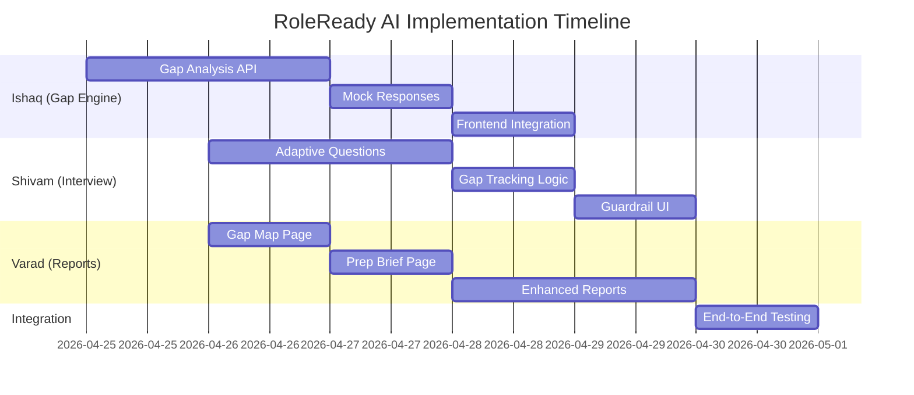

# RoleReady AI — Implementation Roadmap

**Status:** 🟡 60% Complete (AI Core operational, gap analysis features missing)  
**Goal:** Complete the gap-driven adaptive interview platform described in README  
**Timeline:** 5-7 days for full implementation  
**Team:** 3 developers (Ishaq, Shivam, Varad)

---

## 📊 Current State vs. Target State

### ✅ What's Working (60%)
- AI Core microservice with 6 session types
- Voice-first interviews (WebSocket + TTS/STT)
- Practice setup page
- Interview room with real-time feedback
- Basic evaluation reports
- Dashboard with session history
- Mock mode (no API keys needed)

### 🎯 What's Missing (40%)
- Gap analysis engine (JD + resume comparison)
- Readiness gap map visualization
- Prep brief generation
- Adaptive question generation from gaps
- Live gap tracking during interview
- Gap closure tracking in reports
- Ghostwriting guardrail UI

---

## 🗺️ Implementation Strategy

### Three Parallel Workstreams



---

## 📅 Phase 1: Foundation (Days 1-2)

**Goal:** Get gap analysis working end-to-end

### Ishaq: Gap Analysis Engine
**Priority:** 🔴 Critical Path  
**Estimated Time:** 2 days

#### Task 1.1: Backend API Endpoint (4 hours)
```python
# backend/api/readiness.py (NEW FILE)
@router.post("/api/readiness/analyze")
async def analyze_readiness(request: ReadinessAnalysisRequest):
    """
    Input: JD, resume, company, role
    Output: ReadinessAnalysisResponse with gaps
    """
```

**Deliverables:**
- [ ] Create `backend/api/readiness.py`
- [ ] Define `ReadinessAnalysisRequest` model
- [ ] Define `ReadinessAnalysisResponse` model
- [ ] Implement LLM call to Groq
- [ ] Parse JSON response into gap categories
- [ ] Store in `sessions` and `gaps` tables
- [ ] Return structured response

**Dependencies:** None  
**Blocks:** All other tasks

#### Task 1.2: LLM Prompt Engineering (2 hours)
```markdown
# prompts/readiness_analysis.md (NEW FILE)
Analyze the candidate's resume against the job description.
Categorize skills into: strong_matches, partial_matches, missing_or_weak
```

**Deliverables:**
- [ ] Create prompt template
- [ ] Test with example JD + resume
- [ ] Validate JSON output format
- [ ] Add few-shot examples

**Dependencies:** None  
**Blocks:** Task 1.1

#### Task 1.3: Mock Mode Support (2 hours)
```python
# backend/llm/mock_responses.py
MOCK_RESPONSES["readiness_analysis"] = {
    "readiness_score": 65,
    "strong_matches": [...],
    "partial_matches": [...],
    "missing_or_weak": [...]
}
```

**Deliverables:**
- [ ] Add mock response to `mock_responses.py`
- [ ] Test with `MOCK_LLM=1`
- [ ] Validate response structure
- [ ] Add to health check

**Dependencies:** Task 1.1  
**Blocks:** Frontend integration

#### Task 1.4: Database Migration (2 hours)
```sql
-- database/migrations/002_roleready_extensions.sql
ALTER TABLE sessions ADD COLUMN target_role TEXT;
ALTER TABLE sessions ADD COLUMN readiness_score INTEGER;
-- ... (see existing migration file)
```

**Deliverables:**
- [ ] Verify migration file exists
- [ ] Run migration on dev database
- [ ] Test gap insertion
- [ ] Document schema changes

**Dependencies:** None  
**Blocks:** Task 1.1

---

### Varad: Gap Map Frontend (Parallel)
**Priority:** 🟡 High  
**Estimated Time:** 1 day

#### Task 1.5: Gap Map Page (4 hours)
```typescript
// web/app/practice/gap-map/page.tsx (NEW FILE)
export default function GapMapPage() {
  // Display readiness score
  // Show strong/partial/missing skills
  // "Continue to Prep Brief" button
}
```

**Deliverables:**
- [ ] Create `/practice/gap-map` page
- [ ] Fetch analysis from API
- [ ] Display readiness score (0-100)
- [ ] Visual skill categorization
- [ ] Navigation to prep brief

**Dependencies:** Task 1.1 (API endpoint)  
**Blocks:** None

#### Task 1.6: Gap Map Components (4 hours)
```typescript
// web/components/roleready/ReadinessScoreCard.tsx (NEW)
// web/components/roleready/SkillGapMap.tsx (NEW)
```

**Deliverables:**
- [ ] `ReadinessScoreCard` component
- [ ] `SkillGapMap` component with visual categories
- [ ] Responsive design
- [ ] Loading states
- [ ] Error handling

**Dependencies:** Task 1.5  
**Blocks:** None

---

## 📅 Phase 2: User Flow (Days 3-4)

**Goal:** Complete the setup → gap map → prep brief → interview flow

### Ishaq: Prep Brief Generation
**Priority:** 🟡 High  
**Estimated Time:** 1 day

#### Task 2.1: Prep Brief Logic (3 hours)
```python
# backend/api/readiness.py
def generate_prep_brief(gaps: List[Gap]) -> List[str]:
    """Generate 3-5 actionable prep tips from gaps"""
```

**Deliverables:**
- [ ] Add prep brief generation to analysis
- [ ] LLM prompt for brief generation
- [ ] Return in `ReadinessAnalysisResponse`
- [ ] Mock response

**Dependencies:** Task 1.1  
**Blocks:** Task 2.2

#### Task 2.2: Interview Focus Areas (2 hours)
```python
# backend/api/readiness.py
def extract_focus_areas(gaps: List[Gap]) -> List[str]:
    """Extract 2-3 key areas to probe in interview"""
```

**Deliverables:**
- [ ] Focus area extraction logic
- [ ] Priority ordering (probe missing gaps first)
- [ ] Store in session metadata
- [ ] Pass to interview orchestrator

**Dependencies:** Task 2.1  
**Blocks:** Task 3.1 (Shivam)

---

### Varad: Prep Brief Page
**Priority:** 🟡 High  
**Estimated Time:** 1 day

#### Task 2.3: Prep Brief Page (4 hours)
```typescript
// web/app/practice/prep-brief/page.tsx (NEW FILE)
export default function PrepBriefPage() {
  // Display prep tips
  // Show focus areas
  // "Start Interview" button
}
```

**Deliverables:**
- [ ] Create `/practice/prep-brief` page
- [ ] Display prep brief items
- [ ] Show interview focus areas
- [ ] Navigation to interview
- [ ] Update `StepProgress` component

**Dependencies:** Task 2.1  
**Blocks:** None

#### Task 2.4: Update Setup Flow (2 hours)
```typescript
// web/app/practice/setup/page.tsx
const handleAnalyze = async () => {
  const analysis = await api.readiness.analyze({...});
  router.push(`/practice/gap-map?session_id=${analysis.session_id}`);
};
```

**Deliverables:**
- [ ] Add "Analyze My Readiness" button
- [ ] Call readiness API
- [ ] Navigate to gap map
- [ ] Update step progress
- [ ] Error handling

**Dependencies:** Task 1.1  
**Blocks:** None

---

## 📅 Phase 3: Adaptive Interview (Days 4-5)

**Goal:** Make interview questions gap-driven with live tracking

### Shivam: Adaptive Question Generation
**Priority:** 🔴 Critical Path  
**Estimated Time:** 2 days

#### Task 3.1: Gap-Driven Question Generator (4 hours)
```python
# backend/orchestrator/question_generator.py
def generate_questions_from_gaps(
    gaps: List[Gap],
    focus_areas: List[str]
) -> List[Question]:
    """Generate 4-6 questions targeting specific gaps"""
```

**Deliverables:**
- [ ] Question generation from gaps
- [ ] Priority ordering (missing > partial > strong)
- [ ] LLM prompt for gap-specific questions
- [ ] Mock responses
- [ ] Integration with session creation

**Dependencies:** Task 2.2 (Ishaq)  
**Blocks:** Task 3.2

#### Task 3.2: Live Gap Tracking (4 hours)
```python
# backend/orchestrator/gap_tracker.py (NEW FILE)
class GapTracker:
    def update_gap_status(self, gap_id: str, evidence: str):
        """Update gap status: open → improved → closed"""
```

**Deliverables:**
- [ ] Create `GapTracker` class
- [ ] Update gap status during interview
- [ ] Detect when candidate addresses a gap
- [ ] Store evidence in `gaps` table
- [ ] Return updated gaps in turn response

**Dependencies:** Task 3.1  
**Blocks:** Task 3.3

#### Task 3.3: Typed Interview Endpoint (3 hours)
```python
# backend/api/sessions.py
@router.post("/api/sessions/{id}/turns")
async def submit_turn(session_id: str, turn: TurnRequest):
    """
    Process typed turn with gap tracking
    Return: TurnResponse with updated gaps
    """
```

**Deliverables:**
- [ ] Create typed turn endpoint
- [ ] Integrate gap tracker
- [ ] Ghostwriting detection
- [ ] Follow-up generation
- [ ] Return gap updates

**Dependencies:** Task 3.2  
**Blocks:** Task 3.4

#### Task 3.4: Ghostwriting Guardrail UI (2 hours)
```typescript
// web/components/roleready/GhostwritingGuardrailBadge.tsx (NEW)
export function GhostwritingGuardrailBadge() {
  return <div className="badge">Agency Guardrail Activated</div>;
}
```

**Deliverables:**
- [ ] Create guardrail badge component
- [ ] Show when `guardrail_activated: true`
- [ ] Animation/highlight effect
- [ ] Add to interview room

**Dependencies:** Task 3.3  
**Blocks:** None

---

### Varad: Live Gap Panel
**Priority:** 🟡 High  
**Estimated Time:** 1 day

#### Task 3.5: Live Gap Panel Component (4 hours)
```typescript
// web/components/roleready/LiveGapPanel.tsx (NEW FILE)
export function LiveGapPanel({ gaps }: { gaps: Gap[] }) {
  // Show open/improved/closed gaps
  // Update in real-time during interview
}
```

**Deliverables:**
- [ ] Create `LiveGapPanel` component
- [ ] Display gaps by status
- [ ] Visual indicators (🔴 open, 🟡 improved, 🟢 closed)
- [ ] Real-time updates from turn responses
- [ ] Responsive sidebar layout

**Dependencies:** Task 3.2 (Shivam)  
**Blocks:** Task 3.6

#### Task 3.6: Three-Panel Interview Layout (3 hours)
```typescript
// web/app/practice/interview/page.tsx
<div className="grid grid-cols-[300px_1fr]">
  <LiveGapPanel gaps={gaps} />
  <div>
    <TranscriptView />
    <InputArea />
  </div>
</div>
```

**Deliverables:**
- [ ] Update interview page layout
- [ ] Add gap panel sidebar
- [ ] Responsive design (collapse on mobile)
- [ ] Update transcript area
- [ ] Add guardrail badge

**Dependencies:** Task 3.5  
**Blocks:** None

---

## 📅 Phase 4: Enhanced Reporting (Days 5-6)

**Goal:** Show gap closure and next practice plan in reports

### Varad: Enhanced Report Page
**Priority:** 🟡 High  
**Estimated Time:** 2 days

#### Task 4.1: Gap Closure Analysis (4 hours)
```python
# backend/api/sessions.py
def analyze_gap_closure(session_id: str) -> GapClosureReport:
    """
    Compare initial gaps vs. final gaps
    Calculate closure rate
    Identify remaining gaps
    """
```

**Deliverables:**
- [ ] Gap closure calculation logic
- [ ] Compare initial vs. final gap status
- [ ] Calculate closure percentage
- [ ] Identify strongest improvements
- [ ] Add to report generation

**Dependencies:** Task 3.2 (Shivam)  
**Blocks:** Task 4.2

#### Task 4.2: Next Practice Plan (3 hours)
```python
# backend/api/sessions.py
def generate_next_practice_plan(gaps: List[Gap]) -> List[str]:
    """
    Generate 3-5 actionable next steps
    Based on remaining gaps
    """
```

**Deliverables:**
- [ ] Next practice plan generation
- [ ] LLM prompt for recommendations
- [ ] Priority ordering
- [ ] Mock response
- [ ] Add to report

**Dependencies:** Task 4.1  
**Blocks:** Task 4.3

#### Task 4.3: Enhanced Report UI (4 hours)
```typescript
// web/app/practice/report/page.tsx
<div>
  <ReportSummary />
  <GapClosureSection />  {/* NEW */}
  <ScoreCard />
  <NextPracticePlan />   {/* ENHANCED */}
</div>
```

**Deliverables:**
- [ ] Add gap closure section
- [ ] Visual gap closure chart
- [ ] Enhanced next practice plan
- [ ] Before/after comparison
- [ ] Export report button

**Dependencies:** Task 4.2  
**Blocks:** None

---

## 📅 Phase 5: Integration & Testing (Day 7)

**Goal:** End-to-end testing and polish

### All Team: Integration Testing
**Priority:** 🔴 Critical  
**Estimated Time:** 1 day

#### Task 5.1: End-to-End Flow Test (3 hours)
**Test Scenario:**
1. Paste JD + resume
2. Click "Analyze My Readiness"
3. View gap map (score, categories)
4. Review prep brief
5. Start interview
6. Answer vaguely → see targeted follow-up
7. Ask for perfect answer → see guardrail
8. Watch gaps close in live panel
9. Finish interview
10. View enhanced report with gap closure

**Deliverables:**
- [ ] Manual test of full flow
- [ ] Document any bugs
- [ ] Fix critical issues
- [ ] Verify mock mode works

**Dependencies:** All previous tasks  
**Blocks:** None

#### Task 5.2: Mock Mode Validation (2 hours)
```bash
MOCK_LLM=1 ./start.sh
# Test full flow without API keys
```

**Deliverables:**
- [ ] Test all endpoints in mock mode
- [ ] Verify deterministic responses
- [ ] Check UI rendering
- [ ] Update mock responses if needed

**Dependencies:** Task 5.1  
**Blocks:** None

#### Task 5.3: Demo Script Update (2 hours)
```markdown
# DEMO_SCRIPT.md
1. Load example data (Google SDE role)
2. Analyze readiness → 65% score
3. Review gap map → missing "distributed systems"
4. Read prep brief → 3 focus areas
5. Start interview → gap-driven questions
6. Trigger guardrail → badge appears
7. View report → 2/5 gaps closed
```

**Deliverables:**
- [ ] Update `DEMO_SCRIPT.md`
- [ ] Add screenshots
- [ ] Document judge path
- [ ] Test demo flow

**Dependencies:** Task 5.1  
**Blocks:** None

#### Task 5.4: Documentation Update (1 hour)
**Deliverables:**
- [ ] Update README with accurate feature list
- [ ] Update architecture diagram
- [ ] Document API endpoints
- [ ] Update testing guide

**Dependencies:** Task 5.3  
**Blocks:** None

---

## 🎯 Success Criteria

### Functional Requirements
- [ ] Gap analysis endpoint returns structured data
- [ ] Gap map page displays readiness score and categories
- [ ] Prep brief page shows actionable tips
- [ ] Interview questions target specific gaps
- [ ] Live gap panel updates during interview
- [ ] Ghostwriting guardrail shows UI badge
- [ ] Report shows gap closure analysis
- [ ] Full flow works in mock mode

### Non-Functional Requirements
- [ ] Gap analysis completes in < 5 seconds
- [ ] Interview turn latency < 2 seconds
- [ ] Report generation < 6 seconds
- [ ] Mobile-responsive UI
- [ ] No console errors
- [ ] All tests pass

### Demo Requirements
- [ ] 10-step judge path works end-to-end
- [ ] Example data loads correctly
- [ ] Mock mode demonstrates full flow
- [ ] Guardrail triggers reliably
- [ ] Gap closure is visible

---

## 📦 Deliverables Checklist

### Backend (Ishaq + Shivam)
- [ ] `backend/api/readiness.py` (NEW)
- [ ] `backend/orchestrator/gap_tracker.py` (NEW)
- [ ] `prompts/readiness_analysis.md` (NEW)
- [ ] `prompts/prep_brief.md` (NEW)
- [ ] `prompts/gap_question_generator.md` (NEW)
- [ ] `backend/llm/mock_responses.py` (UPDATED)
- [ ] `backend/api/sessions.py` (UPDATED)
- [ ] `database/migrations/002_roleready_extensions.sql` (VERIFY)

### Frontend (Varad)
- [ ] `web/app/practice/gap-map/page.tsx` (NEW)
- [ ] `web/app/practice/prep-brief/page.tsx` (NEW)
- [ ] `web/components/roleready/ReadinessScoreCard.tsx` (NEW)
- [ ] `web/components/roleready/SkillGapMap.tsx` (NEW)
- [ ] `web/components/roleready/PrepBriefCard.tsx` (NEW)
- [ ] `web/components/roleready/LiveGapPanel.tsx` (NEW)
- [ ] `web/components/roleready/GhostwritingGuardrailBadge.tsx` (NEW)
- [ ] `web/app/practice/setup/page.tsx` (UPDATED)
- [ ] `web/app/practice/interview/page.tsx` (UPDATED)
- [ ] `web/app/practice/report/page.tsx` (UPDATED)

### Documentation (All)
- [ ] `README.md` (UPDATED)
- [ ] `DEMO_SCRIPT.md` (UPDATED)
- [ ] `TESTING_GUIDE.md` (UPDATED)
- [ ] `IMPLEMENTATION_STATUS.md` (UPDATED)

---

## 🚨 Risk Mitigation

### Risk 1: LLM Prompt Quality
**Impact:** High  
**Mitigation:**
- Start with few-shot examples
- Test with multiple JD/resume pairs
- Iterate on prompt based on output quality
- Have fallback to simpler analysis

### Risk 2: Gap Tracking Accuracy
**Impact:** Medium  
**Mitigation:**
- Use keyword matching as fallback
- Allow manual gap marking
- Show confidence scores
- Iterate based on user feedback

### Risk 3: Integration Complexity
**Impact:** Medium  
**Mitigation:**
- Clear API contracts defined upfront
- Mock responses for parallel development
- Daily sync meetings
- Integration testing on Day 7

### Risk 4: Timeline Slippage
**Impact:** Low  
**Mitigation:**
- Parallel workstreams reduce dependencies
- Mock mode allows frontend work without backend
- MVP scope is well-defined
- Can cut Task 4.3 (enhanced report UI) if needed

---

## 📊 Progress Tracking

### Daily Standup Questions
1. What did you complete yesterday?
2. What are you working on today?
3. Any blockers?
4. Are you on track for your timeline?

### Milestone Checkpoints
- [ ] **Day 2 EOD:** Gap analysis API working
- [ ] **Day 3 EOD:** Gap map + prep brief pages live
- [ ] **Day 5 EOD:** Adaptive interview with live tracking
- [ ] **Day 6 EOD:** Enhanced reports complete
- [ ] **Day 7 EOD:** Full integration tested

---

## 🎬 Quick Start for Each Developer

### Ishaq (Gap Engine)
```bash
# Day 1 Morning
1. Create backend/api/readiness.py
2. Define ReadinessAnalysisRequest/Response models
3. Write prompts/readiness_analysis.md
4. Test with Groq API

# Day 1 Afternoon
5. Add mock response
6. Test with MOCK_LLM=1
7. Verify database migration
8. Document API contract

# Day 2
9. Add prep brief generation
10. Extract interview focus areas
11. Integration test with Varad's frontend
```

### Shivam (Adaptive Interview)
```bash
# Day 1-2
Wait for Ishaq's Task 2.2 (focus areas)

# Day 3 Morning
1. Create gap_tracker.py
2. Implement gap status updates
3. Test gap detection logic

# Day 3 Afternoon
4. Create typed turn endpoint
5. Integrate gap tracker
6. Add ghostwriting detection

# Day 4
7. Generate gap-driven questions
8. Test adaptive follow-ups
9. Integration test with Varad's UI
```

### Varad (Frontend)
```bash
# Day 1 Morning
1. Create /practice/gap-map page
2. Create ReadinessScoreCard component
3. Create SkillGapMap component

# Day 1 Afternoon
4. Test with mock data
5. Add loading states
6. Responsive design

# Day 2
7. Create /practice/prep-brief page
8. Update setup page flow
9. Test navigation

# Day 3-4
10. Create LiveGapPanel component
11. Update interview layout
12. Add guardrail badge

# Day 5-6
13. Enhance report page
14. Add gap closure section
15. Polish UI
```

---

## 📞 Support & Questions

- **API Contract Questions:** Check `design.md` § Workstream sections
- **Database Schema:** See `database/migrations/002_roleready_extensions.sql`
- **Mock Responses:** See `backend/llm/mock_responses.py`
- **Component Examples:** See existing `web/components/roleready/`

---

## ✅ Definition of Done

A task is complete when:
1. Code is written and tested locally
2. Mock mode works (if applicable)
3. No console errors or warnings
4. Responsive design verified
5. Integration points tested
6. Documentation updated
7. Committed to git with clear message

---

**Next Step:** Review this roadmap with the team, assign tasks, and start with Phase 1 (Gap Analysis Foundation).
