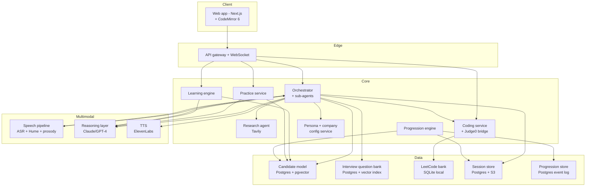
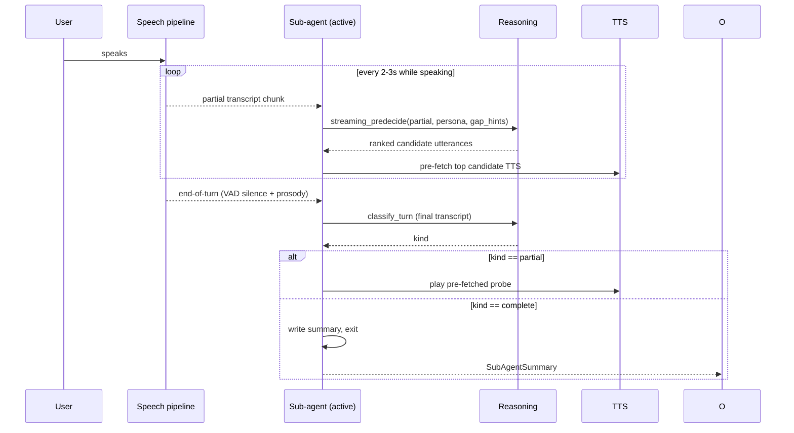
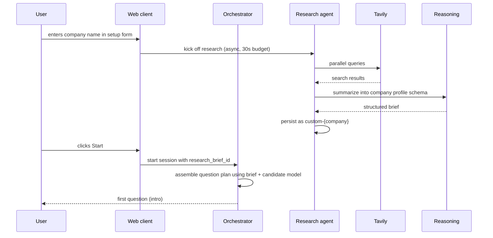
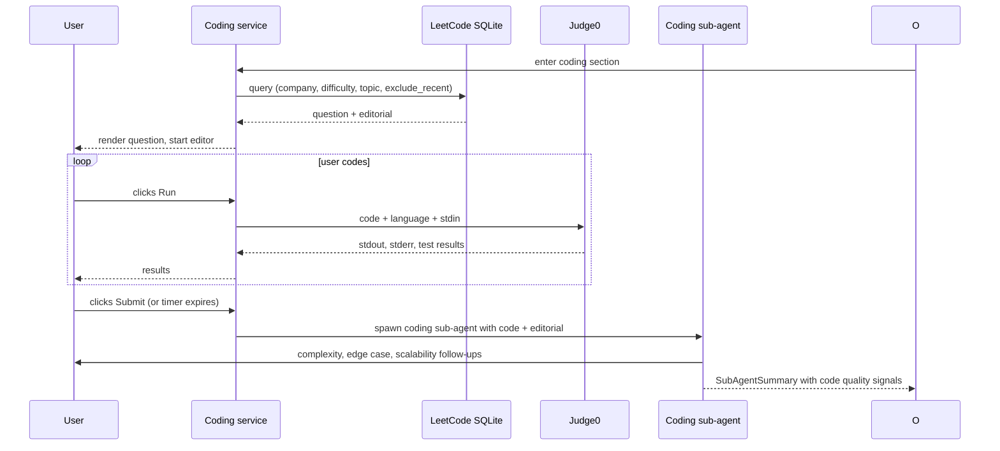
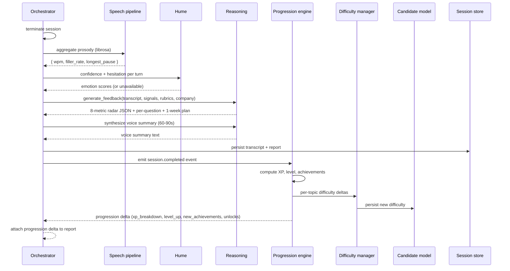
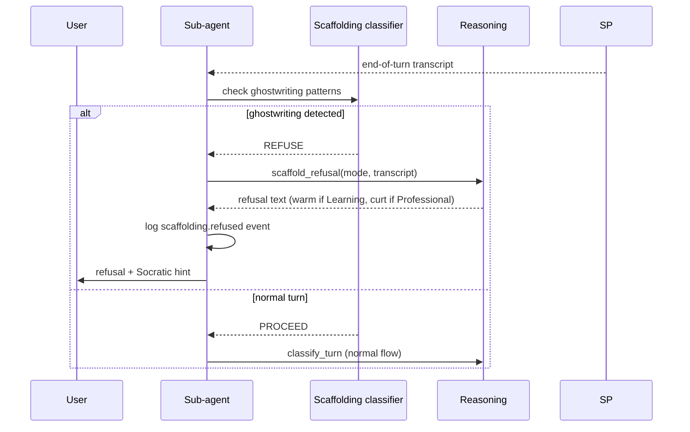

# Interview Coach — Technical Design

## 1. Architecture overview

The system is organized in five layers — web client, edge gateway, core services, multimodal processing, and data. Three architectural patterns carry the differentiation: a **multi-agent orchestrator** (one stateful orchestrator, fresh sub-agent per question), a **streaming pre-decision** loop (next utterance is ready before the user stops talking), and a **scaffolding enforcement layer** (the agent refuses to ghostwrite). A background **research agent** generates dynamic company profiles via Tavily; emotion analysis runs in parallel through Hume alongside objective prosody metrics from librosa.



## 2. Components

### 2.1 Web client (Next.js 14, App Router)

**Pages:** `/dashboard`, `/onboarding`, `/practice`, `/learn/[sessionId]`, `/interview/[sessionId]`, `/code/[sessionId]`, `/report/[sessionId]`, `/profile`, `/achievements`, `/settings`.

Tailwind for styling. Native `MediaRecorder` + WebSocket for audio streaming. TTS audio streamed back as chunked MP3 played via `AudioContext` for low-latency barge-in. **CodeMirror 6** embedded in the coding round with explicit configuration: syntax highlighting on, line numbers and bracket matching on, autocomplete and linting off. Level-up and achievement celebrations render at the end of the post-session report, never mid-session.

The coding UI streams keystrokes to the orchestrator at low frequency (every 5s) so the coding sub-agent has live context for follow-ups, but never autocompletes or suggests edits.

### 2.2 API gateway (Node.js + Fastify)

JWT auth, request routing, WebSocket upgrade for audio streams. Node chosen for efficient concurrent WebSocket handling; Python services stay focused on reasoning.

### 2.3 Interview orchestrator (Python 3.11 + FastAPI)

The state-owning brain. Holds high-level interview state — current phase, time elapsed, topics covered, skill gaps observed — and **spawns a fresh sub-agent per question** so each sub-agent runs against a focused, minimal context. Communicates back and forth with sub-agents which return summaries after their exchange.

**State machine:** `PLANNING` → `INTRO` → `RUNNING_QUESTION` → `INTER_QUESTION` → `RUNNING_QUESTION` → ... → `CLOSING`. Inside `RUNNING_QUESTION`, the active sub-agent owns the substates `AWAITING_USER`, `EVALUATING`, `FORMULATING`, `SPEAKING`.

**Session state shape:**
```python
class Session:
    session_id: UUID
    user_id: UUID
    mode: Literal["learning", "professional"]
    persona_id: str
    company_profile_id: str   # static or custom-{slug}
    format_id: str            # recruiter_screen, technical_screen, custom-...
    target_role: str
    question_plan: list[PlannedQuestion]    # {id, text, topic, difficulty, status, gap_hints, kind}
    thread_tracker: dict[str, ThreadState]  # topic_id -> {status, probes_used, gaps_raised, first_probe_closed}
    sub_agent_summaries: list[SubAgentSummary]
    current_question_id: str | None
    turn_history: list[Turn]
    candidate_snapshot: dict
    difficulty_snapshot: dict
    research_brief_id: str | None
    voice_id: str             # consistent ElevenLabs voice across sub-agents
    started_at: datetime
```

### 2.4 Per-question sub-agent (Python module spawned by orchestrator)

A sub-agent is **stateless across questions** — it does not carry forward from prior questions. It receives:
- The question text and gap hints
- The candidate's intro summary
- A short summary of relevant prior turns ("the candidate already gave a STAR-structured answer about a deadline conflict")
- The persona and mode prompt fragments
- The shared voice ID (so all sub-agents speak with one voice)

It runs the per-turn loop (classify → probe / advance / clarify / stall → emit utterance) until its question is resolved or the orchestrator preempts it. On exit it writes a `SubAgentSummary`: how the candidate performed, gaps still unresolved, confidence signals observed, suggested next probe topic for the orchestrator's planning.

### 2.5 Streaming pre-decision (orchestrator submodule)

While the user is speaking, every 2–3 seconds the active sub-agent runs a lightweight reasoning call against the rolling partial transcript that:
1. Extracts current answer state — what the candidate has covered, missed, or hedged
2. Ranks the top 3 candidate next-utterances (probe gap A, probe gap B, advance to next question, clarify)
3. Pre-fetches the TTS audio for the top candidate

**On end-of-turn detection** (VAD silence), the orchestrator picks the top-ranked utterance, plays the pre-fetched audio, and the conversation continues with no pause. If the user resumes speaking before end-of-turn confirms, the pre-decided utterance is discarded and the analysis re-runs.

This is the sharp end of "the orchestrator listens" — it's not just tracking state, it's actively planning while the user talks.

### 2.6 Research agent (Python service)

On user company selection (or when "Custom" is typed), the research agent fires Tavily queries and assembles a brief. It runs concurrent queries on:
- "{Company} interview process for {role}"
- "{Company} {role} interview questions Glassdoor Reddit Blind"
- "{Company} engineering blog tech stack"
- "{Company} {role} leveling and expectations"

Tavily results are summarized via Claude into a structured brief matching the company profile schema (topic_weights, rubric_emphases, default_persona_id, round_structure, key_signals). The brief is persisted as a custom company profile (`custom-{slug}-{timestamp}`) so future sessions can reuse it. The **30-second budget** is hard — if the agent doesn't return in time, the orchestrator proceeds with the static company profile or generic role-tuned profile, surfacing a non-blocking notice to the user.

The brief is **shown to the user** on the pre-session screen so the process is transparent (the InterviewOS "no black box" principle).

### 2.7 Practice service (Python + FastAPI)

Drives single-drill practice mode. Drills are defined declaratively in `config/practice_drills.yaml` — each drill specifies its question, expected rubric, follow-up template, and per-drill scoring breakdown. The service loads the drill, runs a focused single-question loop (minimal orchestration, no full sub-agent ceremony), and produces a structured per-drill score on the spot. Results count for streak and award half the XP of full interviews.

### 2.8 Guided learning engine (Python + FastAPI)

Conversational tutor mode. Selects topics by lowest confidence in the candidate model not practiced in 24 hours. Uses a Socratic prompt template constrained to short utterances with required re-engagement questions. Updates the candidate model on each turn. This is conceptually distinct from Practice mode — Practice is single-question repeat-and-score; Guided Learning is open-ended back-and-forth concept building.

### 2.9 Coding service (Python + FastAPI)

Bridges the in-app CodeMirror editor and the local Judge0 instance. Exposes:
- `POST /code/run` — accepts code, language, and stdin; forwards to Judge0; returns stdout, stderr, compile errors, per-test-case pass/fail
- `GET /code/questions` — queries the LeetCode SQLite bank by company, difficulty, topic, excluding any question shown to the user in the past 30 days
- `POST /code/submit` — final submission triggers the coding sub-agent with the editorial reference loaded into context (never shown to user)

The editorial solution from the LeetCode bank is loaded into the coding sub-agent's context so it can evaluate the candidate's approach informedly and ask targeted follow-ups, but the editorial is **never** rendered to the user during or after the session.

### 2.10 Speech pipeline

Three parallel processors on the same audio stream:
- **Streaming ASR** — Deepgram Nova-3 primary, Whisper v3-large self-hosted fallback. Emits interim and final transcripts.
- **Hume Voice emotion** — final-turn audio chunks sent to Hume; returns confidence and hesitation scores per turn.
- **Objective prosody** — librosa + parselmouth on final transcripts; computes WPM, pause length distribution, pitch range, filler-word rate.

The three feed a unified `TurnSignals` object that the orchestrator and the post-session feedback generator consume. If Hume is down, the system continues; the report marks emotion metrics as unavailable rather than fabricates them.

### 2.11 Reasoning layer

Wrapper around the Anthropic Messages API (Claude Opus primary, Sonnet for low-cost paths like the classifier and streaming pre-decision) with OpenAI GPT-4 as fallback. Exposes typed endpoints per prompt template: `classify_turn`, `generate_probe`, `generate_feedback`, `socratic_step`, `safe_clarification`, `streaming_predecide`, `scaffold_refusal`, `research_brief`. Templates live under version control in `prompts/`. Every call logs prompt version, input hash, latency, and token count.

### 2.12 TTS layer

ElevenLabs streaming MP3, single voice ID per session shared across all sub-agents so the candidate hears one consistent interviewer. OpenAI TTS as fallback. The TTS layer supports cancel-mid-stream for barge-in (clean the buffer when the user starts speaking).

### 2.13 Persona and company calibration service

Stateless config service. Personas in `config/personas/*.yaml`, modes in `config/modes/*.yaml`, companies in `config/companies/*.yaml` (static) or persisted to Postgres (research-generated). Configs schema-validated at service start.

**Persona config example:**
```yaml
id: challenging
tone: matter_of_fact
acknowledgment_style: minimal
pushback_frequency: high
probe_depth: aggressive
silence_threshold_seconds: 6   # how long to wait before nudging on stall
prompt_fragment: |
  You are a demanding but fair technical interviewer. You push back on
  vague claims. You rarely praise. You move on only when the candidate
  has clearly addressed the gap.
```

**Company profile example:**
```yaml
id: amazon
display_name: Amazon
topic_weights:
  behavioral.leadership_principles: 2.0
  behavioral.customer_obsession: 1.8
  dsa: 1.0
  system_design: 1.2
rubric_emphases:
  - STAR-format specificity
  - ownership signals
  - data-driven reasoning
default_persona_id: challenging
round_structure:
  - { name: Behavioral, topic: behavioral, duration_min: 30 }
  - { name: Coding, topic: dsa, duration_min: 45 }
  - { name: System design, topic: system_design, duration_min: 45 }
key_signals:
  - look for explicit mention of metrics in behavioral answers
  - expect bar-raiser-style "tell me about a time you disagreed" probes
```

### 2.14 Progression engine (Python + FastAPI)

Central authority for XP, levels, streaks, achievements, and per-topic difficulty. Server-authoritative; never trusts client state.

**On `session.completed`:**
1. Load session summary (mode, content score, per-topic thread outcomes, difficulty at start)
2. Compute XP via `base × quality × difficulty + streak_bonus`
3. Write immutable `xp_event`
4. Recompute level; if crossed, write `level_up_event` and populate `user_feature_unlocks`
5. Update streak with timezone-aware day boundary; consume freeze if available
6. Evaluate achievements via the rule engine (criteria from `config/achievements.yaml`)
7. Invoke Difficulty Manager for per-topic delta computation
8. Emit `progression.updated` for UI

### 2.15 Difficulty manager (module within Progression Engine)

For each topic touched in a session:
- success_count = threads closed on first probe
- struggle_count = threads requiring 3+ probes or unresolved
- delta = +1 if success > struggle, -1 if struggle > success, 0 otherwise (bounded ±1)
- Write new value to `candidate_topics`, log `difficulty_change_event`

### 2.16 Scaffolding enforcement layer

Two parts:
1. A shared prompt fragment in `prompts/scaffold_refusal.md` injected into every sub-agent's context. It defines the rule and includes positive and negative examples of correct refusal behavior.
2. A lightweight middleware classifier that runs on each user turn detecting ghostwriting attempts (regex patterns + a short LLM check on ambiguous cases). When triggered, it forces the next utterance through the `scaffold_refusal` prompt template, ensuring the refusal lands deterministically rather than depending on the sub-agent to remember the rule.

Refusals are logged as `scaffolding.refused` events. A regression eval set (`services/orchestrator/eval/scaffolding_cases.yaml`) of 25+ ghostwriting attempts runs in CI; deploy is blocked if refusal rate falls below 95%.

### 2.17 Data stores

**Candidate model (Postgres + pgvector):**
```sql
CREATE TABLE candidate_topics (
  user_id UUID, topic_id TEXT, confidence REAL, difficulty INT,
  sample_count INT DEFAULT 0, last_practiced_at TIMESTAMPTZ,
  PRIMARY KEY (user_id, topic_id)
);
CREATE TABLE candidate_attributes (
  user_id UUID, attribute_key TEXT, value JSONB, source TEXT,
  PRIMARY KEY (user_id, attribute_key)
);
```

**Interview question bank (Postgres):** Behavioral, system design, technical concepts, and SQL questions tagged by topic, role, difficulty, company fit, with 3–5 gap hints each. pgvector index for semantic retrieval.

**LeetCode question bank (SQLite local file):** Full problems, examples, constraints, company tags, difficulty, topic tags, editorial solutions with complexity annotations. Imported once on `make setup` from the Hugging Face LeetCode dataset. ~10k rows.

**Session store (Postgres + S3):** Session metadata in Postgres; transcripts in JSONB; raw audio in S3 with 30-day default lifecycle; rendered reports as JSON (Postgres) and PDF (S3).

**Progression store (Postgres):** Event tables (`xp_events`, `level_up_events`, `streak_events`, `achievement_earned_events`, `difficulty_change_events`, `scaffolding_refused_events`) all append-only. State tables (`user_levels`, `streaks`, `user_achievements`, `user_feature_unlocks`) derived from event log; can be replayed if formulas change.

## 3. Key sequence flows

### 3.1 Streaming pre-decision turn



### 3.2 Session start with research agent



### 3.3 Coding round flow



### 3.4 Post-session feedback generation



### 3.5 Scaffolding refusal middleware



## 4. ADRs

### ADR-001: Multi-agent (orchestrator + sub-agents) over single-agent
**Context:** A single agent holding the whole interview in context window struggles to produce sharp follow-ups by the time the conversation has multiple questions. Real interviewers compartmentalize.
**Decision:** A stateful orchestrator owns global session state. A fresh sub-agent is spawned per question with focused context (question text, gap hints, intro summary, persona fragment). Sub-agents return summaries to the orchestrator on exit.
**Consequences:** More coordination plumbing (sub-agent lifecycle, summary protocol) but markedly sharper per-question follow-ups and clean horizontal scaling.

### ADR-002: Streaming pre-decision while user speaks
**Context:** Even with streaming ASR, the gap between end-of-user-speech and AI-utterance feels unnatural at 2+ seconds.
**Decision:** Run a lightweight reasoning call against partial transcripts every 2–3 seconds, ranking next utterances. Pre-fetch TTS for the top candidate. On end-of-turn, play immediately.
**Consequences:** Higher LLM call rate per session (3–5× a naive approach) but the interaction feels human. Cost is mitigated by using Sonnet for the pre-decision calls and Opus only for the final classifier and feedback synthesis.

### ADR-003: Stateful orchestrator separate from LLM
Same as before — locked in. The orchestrator owns session state, invokes LLMs for stateless reasoning. Sub-agent summaries go through this orchestrator.

### ADR-004: Streaming ASR over batched
Same as before — Deepgram WebSocket primary, Whisper fallback.

### ADR-005: Anchor gap hints in the question bank
Same as before — pre-authored gap hints in the question bank radically improve probe relevance.

### ADR-006: Server-authoritative event-sourced progression
Same as before — XP, levels, achievements, difficulty all server-side; events immutable, state tables derived.

### ADR-007: Configs over code for personas, companies, achievements, rubrics, formats, drills
Same as before — YAML-driven runtime tuning. The "spec is the product" lever.

### ADR-008: Per-topic adaptive difficulty
Same as before — global difficulty doesn't reflect uneven user skill; per-topic does.

### ADR-009: Deferred celebrations
Same as before — never interrupt mid-session for level-ups or achievements.

### ADR-010: Tavily-powered research with static profile fallback
**Context:** Static company profiles are reliable but only cover ~10 named companies. Real users target arbitrary companies, and even FAANG profiles drift over time.
**Decision:** A research agent (Tavily + Claude summarization) runs in the background during user setup, with a 30-second budget. Results persist as `custom-{slug}` profiles. On research failure or timeout, the system falls back to the static profile (if one exists) or the generic role-tuned profile.
**Consequences:** Coverage extends to any company the user enters. Research adds external API cost (Tavily + Claude summarization), counted in the per-session ceiling. Refresh policy: re-research if cached profile is older than 30 days.

### ADR-011: Hume for emotion + librosa for objective prosody (parallel, not redundant)
**Context:** librosa/parselmouth gives reliable numeric metrics (WPM, pause length, pitch range) but doesn't directly score "confidence" or "hesitation." Hume specializes in those derived signals.
**Decision:** Run both. Hume scores confidence and hesitation per turn; librosa scores objective metrics. The post-session feedback surfaces both. If they disagree, both are shown — no synthetic blending.
**Consequences:** Two integrations and two failure modes, but richer report and Hume can be omitted gracefully without breaking the report.

### ADR-012: CodeMirror without autocomplete + local Judge0
**Context:** Real interviews use shared editors without IDE assistance. Cloud sandboxes add latency and a subscription dependency.
**Decision:** CodeMirror 6 in-app with autocomplete and linting explicitly off. Code execution via a local Judge0 Docker instance. The LeetCode question bank is a SQLite file imported from the Hugging Face dataset on `make setup`.
**Consequences:** Setup takes 10 minutes (Docker + dataset download) but no cloud account, no API key, and no per-execution cost. The user can run code offline.

### ADR-013: Scaffolding as a cross-cutting middleware, not just a prompt
**Context:** Sub-agents inevitably forget rules buried in long prompts. The "no model answers" principle is too important to leave to prompt diligence alone.
**Decision:** Two-layer enforcement — a shared prompt fragment loaded into every sub-agent, plus a lightweight middleware classifier that detects ghostwriting attempts and forces the response through a dedicated `scaffold_refusal` template. CI enforces ≥ 95% refusal rate on a labeled regression set.
**Consequences:** A small additional LLM call on each user turn (cheap; runs on Sonnet), a regression eval that gates deploys, and a guarantee that the principle holds even when other prompts evolve.

### ADR-014: Practice mode as a separate service from full interviews
**Context:** Single-drill practice and full multi-section interviews have different orchestration needs. Cramming both into the orchestrator made it harder to reason about.
**Decision:** A standalone Practice service with its own simple loop (question → answer → 1-2 follow-ups → score). Drills defined declaratively in YAML. Half XP, full streak credit.
**Consequences:** Fast to ship, fast to extend (new drill = one YAML entry), and the orchestrator stays focused on the high-stakes voice loop.

### ADR-015: Node at the edge, Python for services
Same as before — efficient WebSocket handling at the edge, best ML ecosystem for services.

### ADR-016: Hackathon process collapse (temporary, demo-cut only)
**Context:** The full spec runs 10 Python services + Node gateway + Next.js + Postgres + Redis + Judge0 — 13 processes. For the hackathon submission we have ~36–48 hours and need a demoable single slice (probe-on-partial), not a complete platform. Each service we spin up is a service that fails 30 minutes before judging.
**Decision:** For the duration of the hackathon submission only, collapse to **three processes**: a single Python + FastAPI orchestrator that absorbs gateway, reasoning, persona, speech, and scaffolding as in-process modules; the Next.js web app; and Postgres. No Redis (use a process-local dict for session state and flush to Postgres at session end), no Judge0, no separate Node gateway, no Whisper container. Folder ownership boundaries from `structure.md` still apply for code organization and merge-conflict avoidance — they just compile down to one running binary.
**Consequences:** Session state is non-durable across orchestrator restarts during the demo (acceptable because demo sessions are <10 minutes). The full `services/p1_platform`, `services/p2_interview`, `services/p3_learning` folder split is still authored as designed; the `main.py` of the orchestrator imports modules from each. After hackathon submission, this ADR is reversed and services split back along their package boundaries — no architectural rework, only deployment topology changes. The reasoning, persona, and research clients become module-local function calls instead of HTTP calls during the demo cut; their OpenAPI specs in `proto/openapi/` remain authored as the post-submission contract.
